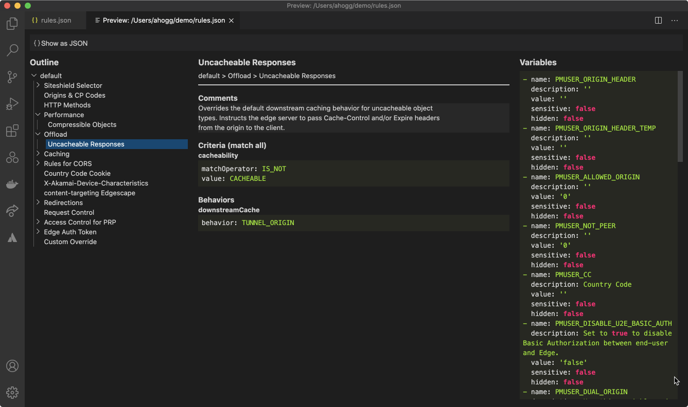
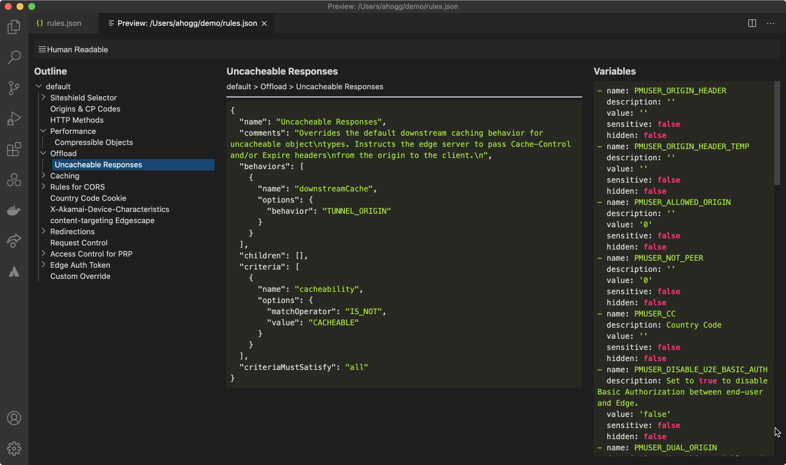

# Akamai PAPI Preview README

Provides a simple read-only UI for reviewing the structure of an Akamai PAPI JSON file without leaving your IDE.

This is helpful if you are managing Akamai configuration as code, where visualizing the entire configuration can be
challenging without using a UI.

## Usage

Assuming you have a PAPI rule tree file open in your active editor, simply invoke the `Akamai PAPI: Preview` command
from the command palette.

The extension does not need any API credentials configured.

## Features

### Simple Explorer

### View rule as JSON

## Release Notes

### 0.0.1

Unreleased.
